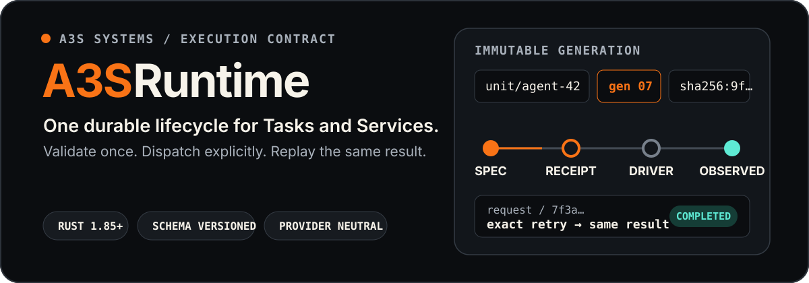
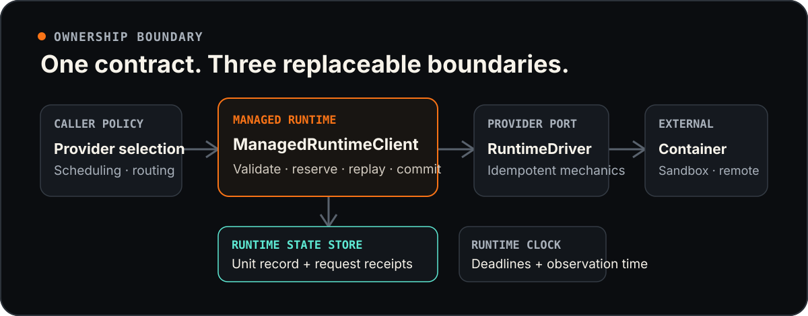

<p align="center">
  
</p>

<p align="center">
  <a href="https://crates.io/crates/a3s-runtime"></a>
  <a href="https://docs.rs/a3s-runtime/latest/a3s_runtime/"></a>
  <a href="https://github.com/A3S-Lab/Runtime/actions/workflows/ci.yml"></a>
  <a href="https://github.com/A3S-Lab/Runtime/blob/main/LICENSE"></a>
  
</p>

<p align="center">
  <a href="#the-contract-at-a-glance">Contract</a> ·
  <a href="#architecture">Architecture</a> ·
  <a href="#use-the-crate">Use the crate</a> ·
  <a href="#durable-replay">Durability</a> ·
  <a href="#provider-conformance">Conformance</a> ·
  <a href="#deliberate-boundaries">Boundaries</a>
</p>

**A3S Runtime** is the provider-neutral execution contract for finite Tasks and
long-running Services. It gives callers one lifecycle API across local,
container, sandbox, and remote providers while keeping provider mechanics
behind a typed driver boundary.

Runtime owns validation, immutable generations, capability admission, durable
request identity, and observed convergence. Scheduling, routing, deployment
workflow, product policy, and provider selection stay with the caller.

## The contract at a glance

Every unit generation is bound to one immutable identity:

```text
(unit_id, generation, canonical_spec_digest)
```

- **Exact retries are replayable.** Every mutating request has a caller-owned
  request ID and a durable receipt.
- **Generation conflicts are deterministic.** Older generations fail with
  `StaleGeneration`; changed content at the same generation fails with
  `GenerationConflict`.
- **Unsupported work stops before dispatch.** Specifications are matched
  against structured provider capabilities before state reservation.
- **Desired and observed state stay separate.** Provider identity, health,
  usage, outputs, evidence, endpoints, attestation, and failure details live in
  `RuntimeObservation`.
- **Provider loss is explicit.** A previously observed resource that disappears
  becomes `unknown`; Runtime does not silently turn loss into success.

| Unit class | Converges when | Typical work |
| --- | --- | --- |
| `Task` | `succeeded` | Builds, migrations, evaluations, backups |
| `Service` | `running`, and healthy when configured | Applications, Agents, MCP servers |

## Architecture

<p align="center">
  
</p>

`ManagedRuntimeClient` is the shared lifecycle implementation. It composes three
replaceable ports:

- [`RuntimeStateStore`](https://docs.rs/a3s-runtime/latest/a3s_runtime/trait.RuntimeStateStore.html)
  owns unit records, request receipts, and per-unit operation leases.
- [`RuntimeDriver`](https://docs.rs/a3s-runtime/latest/a3s_runtime/trait.RuntimeDriver.html)
  owns provider resource mechanics and stable provider identity.
- [`RuntimeClock`](https://docs.rs/a3s-runtime/latest/a3s_runtime/trait.RuntimeClock.html)
  supplies deadline and observation time.

The driver never decides generation or request-conflict policy. The registry
never selects a default provider or silently falls back: callers choose an
explicit `ProviderId` and connect through `RuntimeClientRegistry`.

### One apply, end to end

1. Validate the request schema, unit specification, and canonical digest.
2. Return a completed receipt immediately when the request is an exact replay.
3. Query and validate provider capabilities.
4. Acquire the unit's cross-process operation lease.
5. Reserve the generation and persist a pending request receipt.
6. Dispatch the same durable identity through `RuntimeDriver::apply`.
7. Validate the provider observation and lifecycle postconditions.
8. Atomically publish the observation and completed receipt.

An ambiguous provider acknowledgement leaves the receipt pending. Retrying the
same request reuses the same unit, generation, request ID, and execution budget;
an idempotent driver must discover or converge the existing resource rather
than create a duplicate.

## Use the crate

Install the latest release:

```bash
cargo add a3s-runtime
```

After implementing a provider driver, compose it with the managed lifecycle:

```rust,ignore
use a3s_runtime::{
    FileRuntimeStateStore, ManagedRuntimeClient, RuntimeClient, RuntimeDriver,
};
use std::sync::Arc;

let driver: Arc<dyn RuntimeDriver> = Arc::new(provider_driver);
let client = ManagedRuntimeClient::new(
    Arc::new(FileRuntimeStateStore::new("/var/lib/a3s/runtime")),
    driver,
);

let capabilities = client.capabilities().await?;
let observation = client.apply(&request).await?;
```

Choose the entry point that matches your role:

- **Runtime consumer:** call the
  [`RuntimeClient`](https://docs.rs/a3s-runtime/latest/a3s_runtime/trait.RuntimeClient.html)
  lifecycle directly or obtain one from `RuntimeClientRegistry`.
- **Provider author:** implement `RuntimeDriver`, expose it through a
  `RuntimeProviderFactory`, and make `apply`, `stop`, `remove`, and advertised
  `exec` behavior safe to retry after an ambiguous result.
- **Platform integrator:** replace `RuntimeStateStore` when local filesystem
  durability is insufficient; distributed implementations must provide an
  equivalent fenced per-unit lease.

> [!NOTE]
> `a3s-runtime` 0.2.0 is the latest published crate. The `main` branch also
> contains the newer capabilities v4 and typed Service endpoint contract; use a
> matching source revision when integrating those unreleased APIs.

## Runtime specification

`RuntimeUnitSpec` is immutable for a `(unit_id, generation)` pair and includes:

- digest-bound artifact URI and media type;
- command, arguments, working directory, and environment;
- artifact, volume, and temporary-filesystem mounts;
- opaque secret references targeting environment variables, files, or registry
  credentials;
- network mode, named ports, and TCP/UDP transport;
- CPU, memory, process, optional ephemeral-storage, and execution limits;
- isolation level, health checks, restart policy, and Task outputs;
- an optional digest binding caller-owned execution semantics.

All top-level wire records carry explicit schema identifiers and reject unknown
fields. Provider-specific labels, SDK handles, transport fields, and product
profiles do not enter the core protocol.

### Lifecycle operations

| Operation | Contract |
| --- | --- |
| `capabilities` | Return and validate structured provider support |
| `apply` | Create, reattach, or converge one immutable generation |
| `inspect` | Return the latest observation or generation-aware absence |
| `stop` | Stop the active generation without deleting durable identity |
| `remove` | Remove the provider resource and persist an absence tombstone |
| `logs` | Read ordered, cursor-addressed log chunks |
| `exec` | Run one bounded command against the exact running generation |

Terminal observations (`stopped`, `succeeded`, and `failed`) are immutable.
Tasks may produce exact, digest-bound output artifacts. Services may publish
health and typed node-local endpoints while running.

## Durable replay

The included `FileRuntimeStateStore` persists one active unit record and one
receipt per request:

```text
state root/
├── locks/                         # short record locks
├── operations/                    # full-operation cross-process leases
└── units/
    └── <sha256-unit-key>/
        ├── record.json            # current spec, observation, tombstone
        └── requests/
            └── <request-key>.json # pending or completed result
```

State is written through owner-only temporary files, synchronized, atomically
published, and followed by a directory sync. State paths reject symbolic-link
boundaries. On Unix, directories are tightened to `0700` and files to `0600`.

Same-unit operations are serialized across tasks and processes; different unit
IDs remain parallel. Completed receipts stay replayable after their original
deadline and after later lifecycle operations. Pending work never gains a fresh
execution budget on retry.

## Capabilities and Service publication

Providers describe support as structured sets rather than product-specific
predicates:

- unit classes and artifact media types;
- isolation levels and network modes;
- mount and health-check kinds;
- CPU, memory, PID, ephemeral-storage, and execution-time controls;
- optional lifecycle, logs, exec, usage, attestation, secrets, and output
  features.

Capabilities v4 advertises `ServiceTcp` and `ServiceUdp` independently.
`NetworkMode::Service` specifications are rejected before reservation when a
declared port uses an unadvertised transport.

A running Service publishes exactly one canonical loopback
`RuntimeServiceEndpoint` for every declared port. Endpoint claims are bound to
the observation's provider build and specification digest. Providers own
listener creation, generation fencing, recovery, and cleanup; consumers may
compile routing or health policy from the typed observation but must not invent
an alternate endpoint registry.

## Logs and exec

Logs are generation-bound, strictly ordered, and resumable by cursor. Permanent
cursor loss or source disconnection is returned as a typed
`RuntimeError::LogDiscontinuity`; retryable transport failures remain ordinary
provider errors.

`exec` is deliberately unary and non-interactive:

- one durable request ID and one effective absolute deadline;
- one exit code with separate buffered stdout and stderr;
- a 16 MiB limit for each output stream plus an explicit truncation flag;
- exact replay without executing the command again.

`RuntimeFeature::Exec` does **not** imply stdin streaming, PTY allocation,
terminal resize, signals, incremental output, or reconnectable sessions.

## Provider conformance

Production providers implement `RuntimeConformanceFixture` and run the shared
suite against real, disposable infrastructure:

```rust,ignore
use a3s_runtime::{verify_runtime_profiles, RuntimeConformanceFixture};

let fixture: &dyn RuntimeConformanceFixture = provider_fixture;
let report = verify_runtime_profiles(client.as_ref(), fixture).await?;
assert_eq!(report.inventory_before, report.inventory_after);
```

Base and Recovery are mandatory. Networking, Mounts, Health, Resources, Logs,
Exec, Security, Outputs, and Evidence activate from advertised capabilities.
The suite requires exact case IDs and capability evidence, requests cleanup
even after failure, and rejects any provider inventory delta.

The lower-level `verify_runtime_provider` helper covers the successful Task and
Service lifecycle, but it is not production certification by itself.

## Deliberate boundaries

A3S Runtime intentionally does not own:

- scheduling, placement, routing, traffic switching, or deployment workflows;
- provider-selection policy, login discovery, or default-provider fallback;
- product-specific result shapes or configuration profiles;
- two live generations for one unit ID—rolling deployment uses distinct IDs;
- interactive streaming exec or terminal-session durability.

These boundaries keep the core contract portable and make provider behavior
testable. See the design decisions and delivery plans for the complete
reasoning:

- [ADR 0001 — General Task and Service contract](docs/adr/0001-general-runtime-contract.md)
- [ADR 0002 — Protocol and operation semantics](docs/adr/0002-complete-protocol-and-operation-semantics.md)
- [ADR 0003 — Interactive streaming exec stays outside v0.2](docs/adr/0003-keep-interactive-streaming-exec-outside-v0.2-core.md)
- [ADR 0004 — Typed Service endpoints and protocol capabilities](docs/adr/0004-type-service-endpoints-and-protocol-capabilities.md)
- [ADR 0005 — Host modern stateless MCP as a Service profile (proposed)](docs/adr/0005-host-modern-stateless-mcp-as-a-service-profile.md)
- [Roadmap](ROADMAP.md)
- [Implementation plan](docs/implementation-plan.md)
- [Deep test plan](docs/deep-test-plan.md)

## Development

Run validation from this repository:

```bash
cargo fmt --all --check
cargo test --locked --all-targets
cargo clippy --locked --all-targets -- -D warnings
RUSTDOCFLAGS="-D warnings" cargo doc --locked --no-deps
```

The test suite covers protocol golden files, Task and Service lifecycle,
request and generation conflicts, ambiguous retry, independent deadlines,
provider disappearance, terminal immutability, cross-process races, filesystem
hardening, typed Service endpoints, registry behavior, and provider
conformance.

## License

[MIT](LICENSE) © A3S Lab
