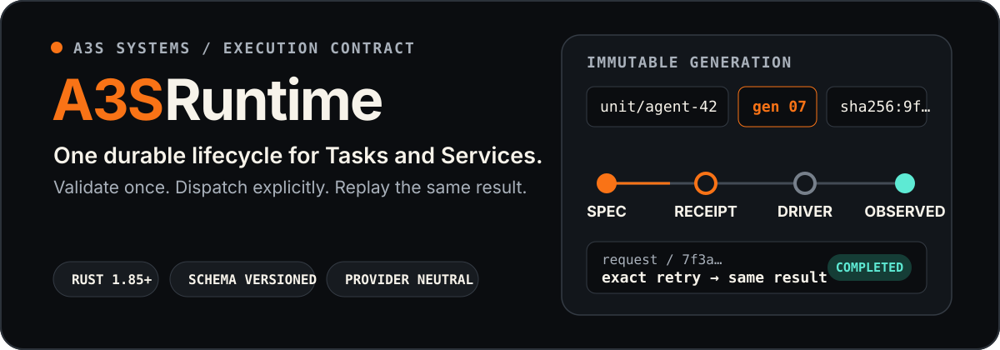
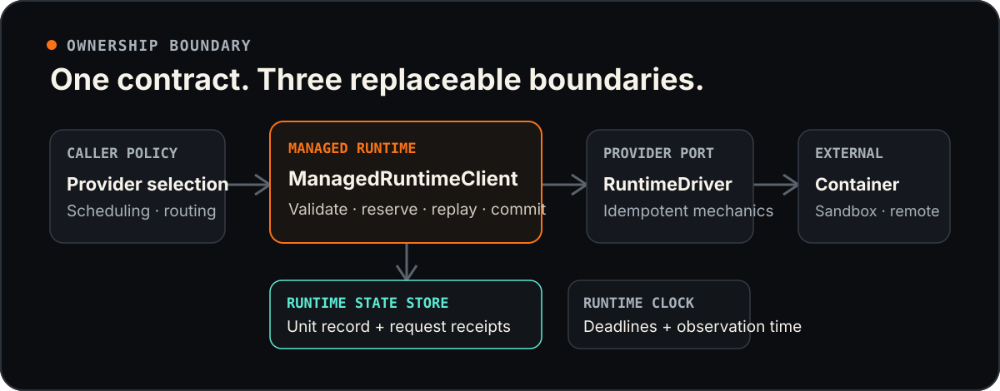

<p align="center">
  
</p>

<p align="center">
  <strong>Language / 语言:</strong>
  <a href="README.md">English</a> ·
  <a href="README.zh-CN.md">中文</a>
</p>

<p align="center">
  <a href="https://crates.io/crates/a3s-runtime"></a>
  <a href="https://docs.rs/a3s-runtime/latest/a3s_runtime/"></a>
  <a href="https://github.com/A3S-Lab/Runtime/actions/workflows/ci.yml"></a>
  <a href="https://github.com/A3S-Lab/Runtime/blob/main/LICENSE"></a>
  
</p>

<p align="center">
  <a href="#the-contract-at-a-glance">合约</a> ·
  <a href="#architecture">架构</a> ·
  <a href="#use-the-crate">使用该 crate</a> ·
  <a href="#durable-replay">持久性</a> ·
  <a href="#provider-conformance">一致性</a> ·
  <a href="#deliberate-boundaries">边界</a>
</p>

**A3S 运行时** 是针对有限任务和提供者中立的执行合约
长期运行的服务。它为调用者提供了跨本地的生命周期 API，
容器、沙箱和远程提供程序，同时保留提供程序机制
在类型化的驱动程序边界后面。

它是 A3S Cloud AaaS 下的单一执行底层，可执行 WaaS
节点、FaaS、托管 MCP 和 Durable Cell 应用程序服务。支持的
生产链使用A3S Box作为流程/沙箱提供者；公共交通
通过 A3S 网关进入，而不是直接通过运行时端点进入。

运行时拥有验证、不可变代、能力准入、持久
请求身份，并观察收敛。调度、路由、部署
工作流程、产品政策和提供商选择由呼叫者保留。

## 契约一览

每个单元生成都绑定到一个不可变的身份：

```text
(unit_id, generation, canonical_spec_digest)
```

- **精确的重试是可重放的。** 每个变异请求都有一个调用者拥有的
  请求 ID 和持久收据。
- **代际冲突是确定性的。**老一代人会失败
  `StaleGeneration`；同一代的更改内容失败
  `GenerationConflict`。
- **发货前不受支持的工作停止。** 规格匹配
  在状态保留之前针对结构化提供商功能。
- **期望的状态和观察到的状态保持分离。** 提供者身份、准备情况、
  活跃度、使用情况、输出、证据、端点、证明和失败
  详细信息请参见`RuntimeObservation`。
- **提供者损失是明确的。** 先前观察到的资源消失了
  变成`unknown`；运行时不会默默地转败为胜。

|单位类别|收敛于 |典型作品|
| ---| ---| ---|
| `Task` | `succeeded` |构建、有限功能、迁移、评估、备份 |
| `Service` | `running`，配置完毕即可使用 |有状态代理、无状态功能/MCP、持久单元应用程序 |

工作流编排不是第三个单元类别。 A3S Flow 拥有耐用的
工作流状态机；仅其可执行的 Agent 或 Function 子项目
到运行时任务或服务。

## 架构

<p align="center">
  
</p>

`ManagedRuntimeClient`是共享生命周期实现。它由三部分组成
可更换端口：

- [`RuntimeStateStore`](https://docs.rs/a3s-runtime/latest/a3s_runtime/trait.RuntimeStateStore.html)
  拥有单位记录、请求收据和每个单位的运营租赁。
- [`RuntimeDriver`](https://docs.rs/a3s-runtime/latest/a3s_runtime/trait.RuntimeDriver.html)
  拥有提供商资源机制和稳定的提供商身份。
- [`RuntimeClock`](https://docs.rs/a3s-runtime/latest/a3s_runtime/trait.RuntimeClock.html)
  供应期限和观察时间。

驱动程序从不决定生成或请求冲突策略。注册表
从不选择默认提供商或默默地退回：调用者选择一个
显式 `ProviderId` 并通过 `RuntimeClientRegistry` 连接。

### 云、运行时、Box 和网关

```text
Client -> A3S Gateway -> A3S Cloud -> A3S Runtime -> A3S Box
          public path    semantics    lifecycle     execution
```

`RuntimeConsumerRequirements` 是一种无线准入/准备状态
消费者档案的抽象。它组成了一个通用单元类，需要
特征、不透明语义证据、服务就绪性/活跃性和精确性
端点，同时将所有产品字段保留在调用者中：

```rust,ignore
use a3s_runtime::contract::{RuntimeFeature, RuntimeUnitClass};
use a3s_runtime::RuntimeConsumerRequirements;

let requirements = RuntimeConsumerRequirements::new(RuntimeUnitClass::Service)
    .require_semantics_profile()
    .require_health()
    .require_service_lifecycle()
    .require_service_endpoints()
    .require_feature(RuntimeFeature::ServiceTcp);

requirements.admit_spec(&spec, &capabilities)?;
requirements.accept_observation(&spec, &observation)?;
```

请参见【统一AI服务运行时](docs/unified-ai-service-runtime.md)】
代理、工作流、功能、MCP 和耐用单元投影矩阵。

### 一次申请，端到端

1. 验证请求架构、单元规范和规范摘要。
2. 当请求是精确重播时，立即返回完整的收据。
3. 查询并验证提供商的能力。
4、取得单位跨流程经营租赁。
5. 保留生成并保留待处理的请求收据。
6. 通过`RuntimeDriver::apply`派发相同的持久身份。
7. 验证提供者观察和生命周期后置条件。
8. 自动发布观察结果和完整的收据。

不明确的提供商确认会使收据悬而未决。重试
相同的请求重用相同的单元、代、请求ID和执行预算；
幂等驱动程序必须发现或聚合现有资源，而不是
而不是创建一个副本。

## 使用该 crate

安装最新版本：

```bash
cargo add a3s-runtime
```

实现提供程序驱动程序后，将其与托管生命周期组合在一起：

```rust,ignore
use a3s_runtime::{
    FileRuntimeStateStore, ManagedRuntimeClient, RuntimeClient, RuntimeDriver,
};
use std::sync::Arc;

let driver: Arc<dyn RuntimeDriver> = Arc::new(provider_driver);
let client = ManagedRuntimeClient::new(
    Arc::new(FileRuntimeStateStore::new("/var/lib/a3s/runtime")),
    driver,
);

let capabilities = client.capabilities().await?;
let observation = client.apply(&request).await?;
```

选择与您的角色匹配的切入点：

- **运行时消费者：**调用
  [`RuntimeClient`](https://docs.rs/a3s-runtime/latest/a3s_runtime/trait.RuntimeClient.html)
  直接获取生命周期或从`RuntimeClientRegistry`获取生命周期。
- **提供者作者：** 实现`RuntimeDriver`，通过
  `RuntimeProviderFactory`，并制作`apply`、`stop`、`remove`，并进行广告宣传
  `exec` 行为在不明确的结果后可以安全地重试。
- **平台集成商：**本地文件系统时替换`RuntimeStateStore`
  持久性不足；分布式实现必须提供
  等效的围栏每单位租赁。

> [!注意]
> `a3s-runtime` 0.5.0 使用功能 v6 和单位规格/观察 v4。它
> 将服务就绪性与活跃性分开，带有有限的优雅停止
> 策略，并保留类型化端点以及不透明的身份证明绑定。
> 生产声明仍需要精确的 A3S Box 认证。

## 运行时规范

`RuntimeUnitSpec` 对于 `(unit_id, generation)` 对来说是不可变的，包括：

- 摘要绑定工件 URI 和媒体类型；
- 命令、参数、工作目录和环境；
- 工件、卷和临时文件系统安装；
- 针对环境变量、文件或注册表的不透明秘密引用
  凭证；
- 网络模式、命名端口和 TCP/UDP 传输；
- CPU、内存、进程、可选的临时存储和执行限制；
- 隔离级别、准备情况、可选的活跃度和优雅停止策略，
  重启策略和任务输出；
- 可选的摘要绑定调用者拥有的执行语义；和
- 可选的不透明身份附件摘要，由确切的提供者重复
  无需进口产品政策的证据。

所有顶级电汇记录都带有显式模式标识符并拒绝未知
字段。提供商特定的标签、SDK 句柄、传输字段和产品
配置文件不进入核心协议。

### 生命周期操作

|运营|契约|
| --- | --- |
| `capabilities` |返回并验证结构化提供商支持 |
| `apply` |创建、重新附加或聚合一个不可变的一代 |
| `inspect` |返回最新的观察结果或一代感知缺席 |
| `stop` |停止活跃生成而不删除持久身份 |
| `remove` |删除提供程序资源并保留缺席墓碑 |
| `logs` |读取有序的、游标寻址的日志块 |
| `exec` |针对精确运行的一代运行一个有界命令 |

终端观测值（`stopped`、`succeeded`和`failed`）是不可变的。
任务可能会产生精确的、摘要绑定的输出工件。服务可能会发布
运行时具有不同的就绪性、活跃性和类型化的节点本地端点。

## 持久重播

随附的 `FileRuntimeStateStore` 保留一项活动单元记录和一项
每个请求的收据：

```text
state root/
├── locks/                         # short record locks
├── operations/                    # full-operation cross-process leases
└── units/
    └── <sha256-unit-key>/
        ├── record.json            # current spec, observation, tombstone
        └── requests/
            └── <request-key>.json # pending or completed result
```

状态是通过仅所有者的临时文件写入的，同步的，原子的
发布，然后进行目录同步。状态路径拒绝符号链接
边界。在 Unix 上，目录被压缩为 `0700`，文件被压缩为 `0600`。

同一单元的操作跨任务和进程串行化；不同单位
ID 保持平行。完成的收据在原始收据之后仍然可以重播
截止日期和以后的生命周期操作之后。待完成的工作永远不会有新鲜感
重试时的执行预算。

## 能力和服务发布

提供商将支持描述为结构化集而不是特定于产品的支持
谓词：

- 单元类别和工件媒体类型；
- 隔离级别和网络模式；
- 安装和健康检查类型；
- CPU、内存、PID、临时存储和执行时间控制；
- 可选的服务生命周期、日志、执行、使用、证明、身份
  附件、秘密和输出功能。

Capability v6 独立通告 `ServiceTcp` 和 `ServiceUdp`，
在发送附加规范之前需要`IdentityAttachment`，
并使`ServiceLifecycle`成为原子活性加上优雅停止保证。
`NetworkMode::Service`规格在预订前被拒绝
申报港口使用未公布的运输方式。准备度和活跃度是
当他们的探针类型没有被公布时被拒绝。

正在运行的服务恰好发布一个规范环回
`RuntimeServiceEndpoint` 对于每个声明的端口。端点声明必须
观察的提供者构建和规范摘要。提供商拥有
侦听器创建、生成屏蔽、恢复和清理；消费者可能
根据键入的观察结果编译路由或健康策略，但不得发明
备用端点注册表。

## 日志和执行

日志是世代限制的、严格排序的并且可以通过游标恢复。永久
光标丢失或源断开作为类型返回
`RuntimeError::LogDiscontinuity`；可重试的传输失败仍然很常见
提供商错误。

`exec` 故意是一元且非交互式的：

- 一份持久的请求ID和一份有效的绝对期限；
- 一个带有单独缓冲的 stdout 和 stderr 的退出代码；
- 每个输出流的 16 MiB 限制加上显式截断标志；
- 精确重播，无需再次执行命令。

`RuntimeFeature::Exec` **不**意味着标准输入流、PTY 分配、
终端调整大小、信号、增量输出或可重新连接的会话。

## 提供商一致性

生产提供商实现`RuntimeConformanceFixture`并运行共享
针对真实的一次性基础设施的套件：

```rust,ignore
use a3s_runtime::{verify_runtime_profiles, RuntimeConformanceFixture};

let fixture: &dyn RuntimeConformanceFixture = provider_fixture;
let report = verify_runtime_profiles(client.as_ref(), fixture).await?;
assert_eq!(report.inventory_before, report.inventory_after);
```

基础和恢复是强制性的。网络、安装、运行状况、资源、日志、
执行、安全、输出和证据通过公布的功能激活。
该套件需要准确的案例 ID 和能力证据，请求清理
即使在失败后，也拒绝任何提供商库存增量。

广告`ServiceLifecycle`还可以激活准备/活跃度
分离、活性过渡、优雅停止和宽限期限强制停止
案例。提供商不得仅根据配置意图来宣传它。

较低级别的`verify_runtime_provider`帮助器涵盖了成功的任务和
服务生命周期，但它本身并不是生产认证。

A3S Box 包含生产 `RuntimeDriver` 和能力触发
固定装置。云产品只有在确切的运行时和框之后才能请求支持
修订通过每个广告配置文件并恢复预测试库存；
无法推断出站网络等未公开的功能。

## 刻意的界限

A3S Runtime 故意不拥有：

- 调度、布局、路由、流量交换或部署工作流程；
- 提供商选择策略、登录发现或默认提供商回退；
- 产品特定的结果形状或配置轮廓；
- 一个单元 ID 的两个实时生成 — 滚动部署使用不同的 ID；
- 交互式流执行或终端会话持久性。

这些边界使核心合约保持可移植性并使得提供商的行为
可测试的。查看完整的设计决策和交付计划
推理：

- [ADR 0001 — 一般任务和服务契约](docs/adr/0001-general-runtime-contract.md)
- [ADR 0002 — 协议和操作语义](docs/adr/0002-complete-protocol-and-operation-semantics.md)
- [ADR 0003 — 交互式流执行位于 v0.2](docs/adr/0003-keep-interactive-streaming-exec-outside-v0.2-core.md) 之外
- [ADR 0004 — 类型化服务端点和协议功能](docs/adr/0004-type-service-endpoints-and-protocol-capabilities.md)
- [ADR 0005 — 托管现代无状态 MCP 即服务配置文件](docs/adr/0005-host-modern-stateless-mcp-as-a-service-profile.md)
- [ADR 0006 — 统一任务、服务和 A3S Box 上的 AI 服务消费者](docs/adr/0006-unify-ai-service-consumers-on-task-service-and-box.md)
- [ADR 0007 — 将不透明身份附件绑定到提供商证明](docs/adr/0007-bind-opaque-identity-attachment-to-provider-attestation.md)
- [ADR 0008 — 单独的服务准备情况、活跃度和优雅停止](docs/adr/0008-separate-service-readiness-liveness-and-graceful-stop.md)
- [统一AI服务运行时](docs/unified-ai-service-runtime.md)
- [路线图](ROADMAP.md)
- 【实施计划](docs/implementation-plan.md)
- 【深度测试计划](docs/deep-test-plan.md)

## 发展

从此存储库运行验证：

```bash
cargo fmt --all --check
cargo test --locked --all-targets
cargo clippy --locked --all-targets -- -D warnings
RUSTDOCFLAGS="-D warnings" cargo doc --locked --no-deps
```

测试套件涵盖协议黄金文件、任务和服务生命周期、
请求和生成冲突、不明确的重试、独立的截止日期、
提供者消失、终端不变性、跨进程竞争、文件系统
强化、类型化服务端点、注册表行为和提供程序
一致性。

## 许可证

[麻省理工学院](LICENSE) © A3S 实验室